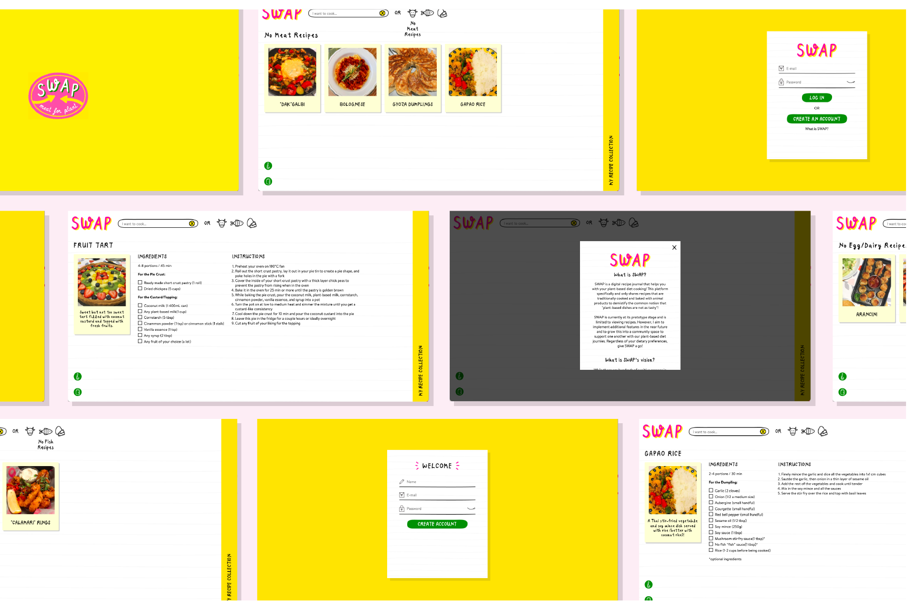

### What is SWAP?

SWAP is a recipe website that helps you with your plant-based diet cooking. This platform specifically and only shares recipes that are traditionally cooked and baked with animal products to demistify the common notion that "plant-based dishes are not as tasty"!

<iframe width="1680" height="970" src="https://www.youtube.com/embed/C8GqXdNLq60" frameborder="0" allow="accelerometer; autoplay; clipboard-write; encrypted-media; gyroscope; picture-in-picture" allowfullscreen></iframe>

### How did SWAP start?

The initial inspiration is deep-rooted in my personal journey of transitioning to a plant-based diet, after moving in with my sister who has been commited to living plant-based for nearly three years. Despite having learnt the consequences of eating animal products for our environment, the unethical treatment of animals in factory farms, and the many benefits of eating plant-based, I'm still finding it difficult to fully give up on certain products like ice cream. Yes, I am a big icecream fan and yes, I am still going through the gradual shifting process.

Most importantly, seeing myself struggle to immediately give up on animal products raised many questions including: What is it about animal products that makes it so appealing? Right around the same time, I came across a quote by feminist-vegan advocate, Carol J. Adams:

> “While they [vegetarians/vegans] think that all that is necessary to make converts to vegetarianism[/veganism] is to point out the numerous problems meat eating causes (…) in a meat-eating culture none of this really matters.”

Reading this quote in her book, _The Sexual Politics of Meat_, I saw the need to ideate alternative approaches to encourage plant-based living. SWAP was therefore developed as a research tool to investigate and better understand our relationship with animal vs plant-based products to better promote veganism. As this is a broad topic, the research was conducted specifically from a linguistic lens whilst investigating the research question: What role does language play in nudging individuals towards ethical dietary choices?

#### Above are some screenshots showcasing my ideation. The full process of the project can be accessed on [Miro](https://miro.com/app/board/o9J_kpx4_Bs=/)!

### What is next in line for SWAP?

SWAP is currently at its prototype stage and is limited to viewing recipes. However, I aim to iteratively redesign, implement additional features in the near future and grow this into a community space to support one another with our plant-based diet journies.
