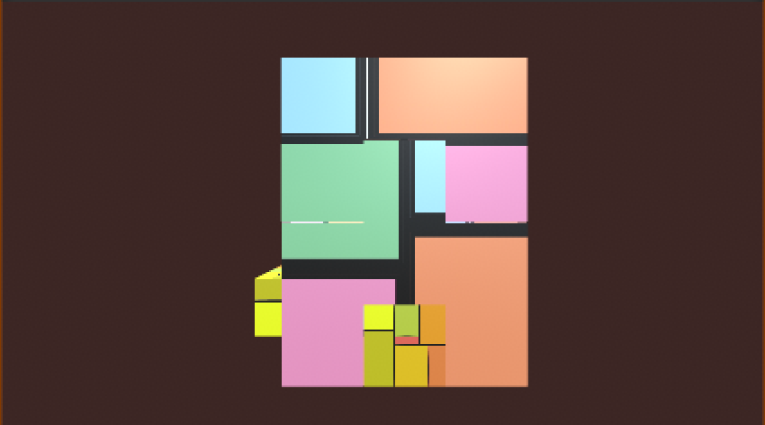

#### [Download the windows game](https://muzitua.itch.io/cube)

CUBe is a digital installation that allows you to take control over shapes and structure. I am hoping to bring out the concept of medium that have introduced by Marshall McLuhan in the 1960s, the time before digital games and the TV were just introduced to the public. Feel the control you have with the shapes and feel the message from the twisted textures over the shape.

<iframe width="560" height="315" src="https://www.youtube.com/embed/6PwUuf-9ljg" frameborder="0" allow="accelerometer; autoplay; clipboard-write; encrypted-media; gyroscope; picture-in-picture" allowfullscreen></iframe>

The concept of this piece is to split a cube into 3 equivalent parts, representing fragments of the content we receive in daily life. This piece is to visualise how information is being reshaped into different forms when you interact with the 3D models. The different combination is generated from the cube, the substance is the same but is transformed, and visual is different from the original cube. So as the media we get in touch, a movie transfers a book into moving images that express differently on screen; a book transforms the speech we say or our imagination.

### Concept comes from Marshall McLuhan, Understanding Media

Animated textures strengthen the sense of media transformation; textures are mapped over the 3D models which you view its appearance with the form that is shown. No one can really see the complete animation with the model structures that are generated for you, which is to emphasise the transformation of media. Texture as the content and the changeable forms as the medium; players can change the forms they receive information, but will never see the complete information as the message that is presented to you is already designed.

<iframe width="560" height="315" src="https://www.youtube.com/embed/ZoFK_3SN0Jo" frameborder="0" allow="accelerometer; autoplay; clipboard-write; encrypted-media; gyroscope; picture-in-picture" allowfullscreen></iframe>

To find more about me, go to my site <https://www.muzitua.com/>
