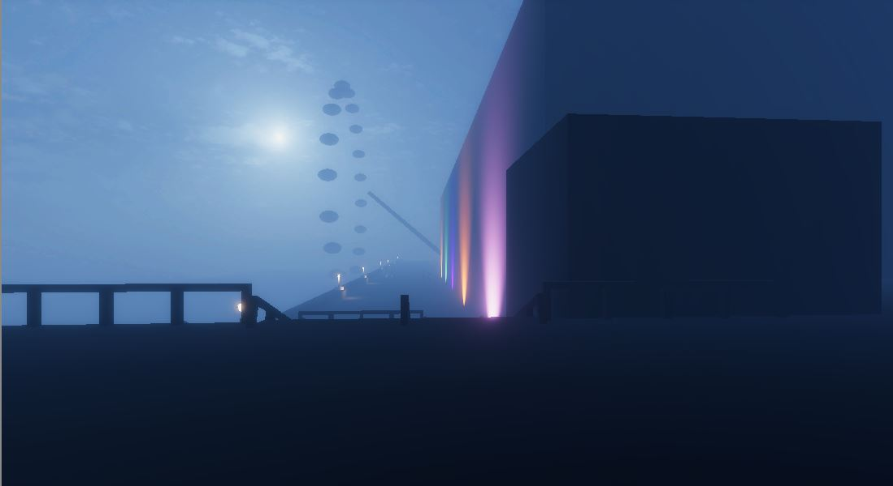

Bystander 

This is a project that's purpose is to try and understand the mindset of people who act as Bystanders when witnessing Sexual Harassment (Male towards Female) and currently the project is focused from the perspective of trying to understand why other males continue to be Bystanders turning a blind eye to these situations.

The project goes from what is considered a rather mild experience from a social media platform to then esculating further and further as the game progresses. 

What the game hopes to tackle is to potentially reduce these situations from happening at all, by forcing the audience to acknowledge these issues happening at hand. By doing this as the developer I hope to see (in safe environments) people standing up against these bullies, standing up to their friends who are overstepping the line of "okay". Which then eventually men in the streets will stop hopefully having these assumptions that they own any women that crosses their path.

Game Link: https://hhallows.itch.io/bystander

