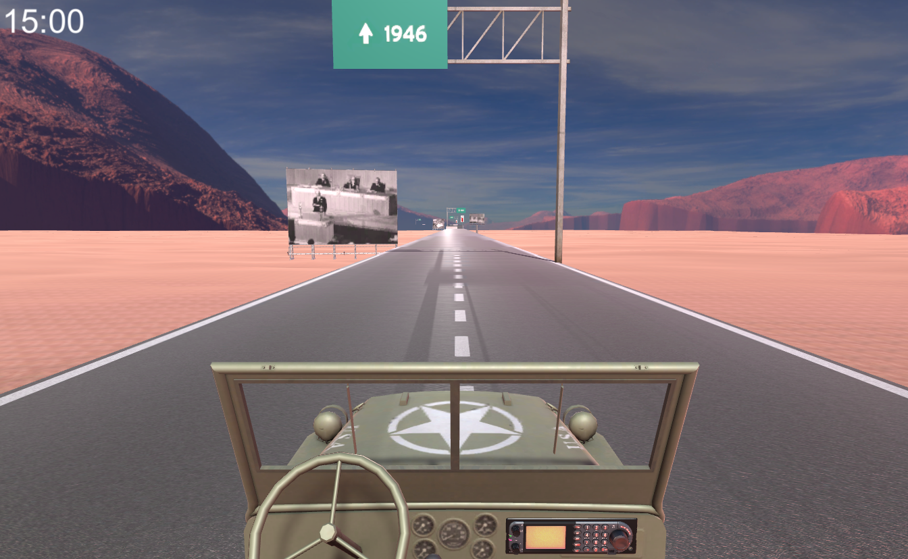

You can play the game here. 

My final project brings past experience in journalism and international relations together with my interest in creative computing. UN road-trip is an attempt to demonstrate a merger of the principles of newsgames and characteristics of news features, creating a proposed new subtype: news feature games. 

The player can drive a jeep along a road which takes them through the UN history. News clips playing on the Jeep’s radio give information of UN highlights from that year. Signs and billboards give information about the year and images of events from the year. An SOS sign with progress bar indicates the number of battle deaths in the world form that year. The road features ramps that ascend or descend depending on whether the number of battle deaths went up or down that year to the previous year. 

The project is la prototype for level one of three covering the years 1946-1970. The news feature game serves as a civic communications tool for investigating the extent to which a videogame is a suitable medium for showing several different types of data and information in an engaging and more interactive way than with other types of media. It also gives the opportunity to research whether it can afford a new perspective on political and social issues.
