Pocket zoo AR is an interactive game for children with the theme of zoo. This game is from an educational point of view, allowing children to learn some animal-related knowledge in the game. This is an interactive game. Children can take pictures of animals in reality to interact with animal models made on the screen, and learn knowledge in the game.

The theme of the project proposal is about the practicality of educational AR applications. Is looking for an interactive way of children's education. I developed an AR application prototype called "Pocket Zoo", which contains 3D animal models that can interact with players. When the player clicks on the animal model on the computer, the model will change the body movements to generate interaction. Look for better ways to educate children by observing the interaction process between children and AR applications.

### Game Interface Design

This is the interface of the game homepage I designed. Click sign in to enter the game. This page is designed based on the audience (kids) and related elements of the zoo.

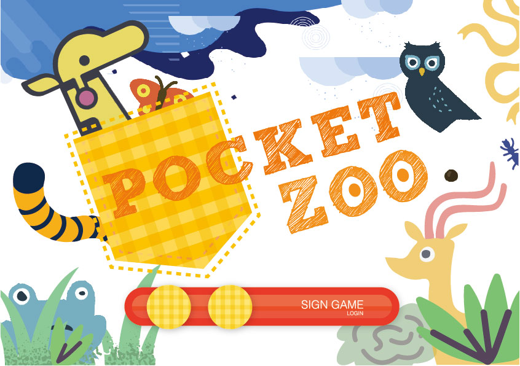

In the interface at the end of the game, I made a design about the zoo vector diagram. Click play again to restart the game.

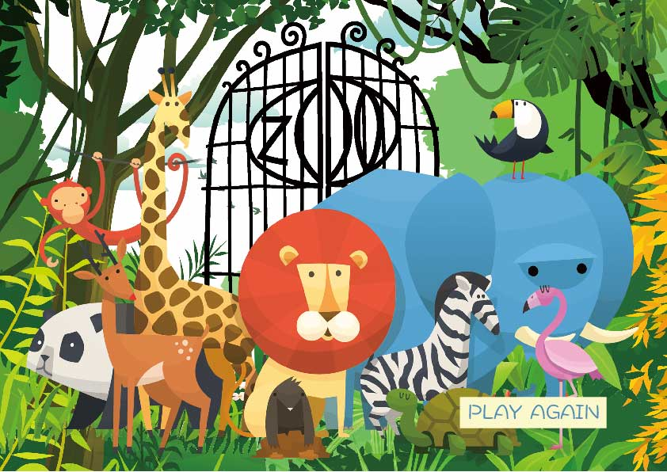

### Game Model and Display (animals)

This is about the pictures of animals and the animal model after camera recognition

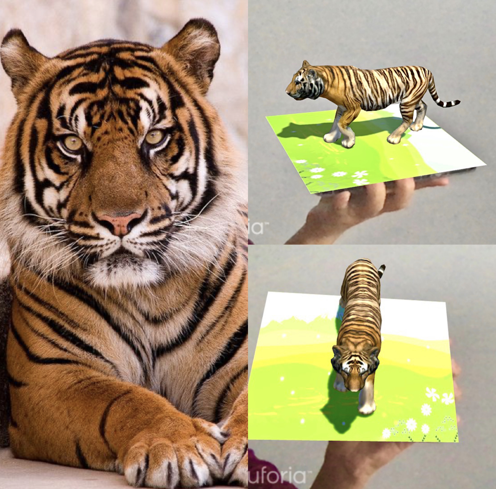
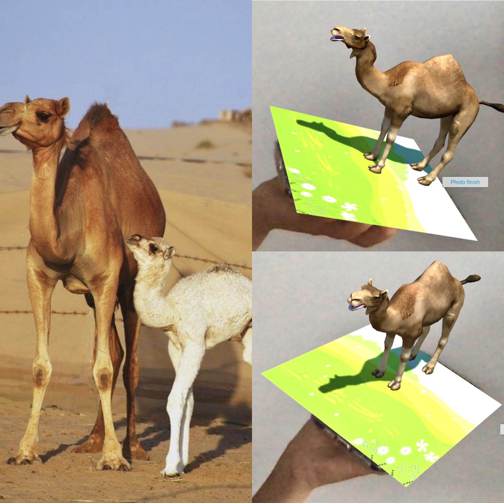
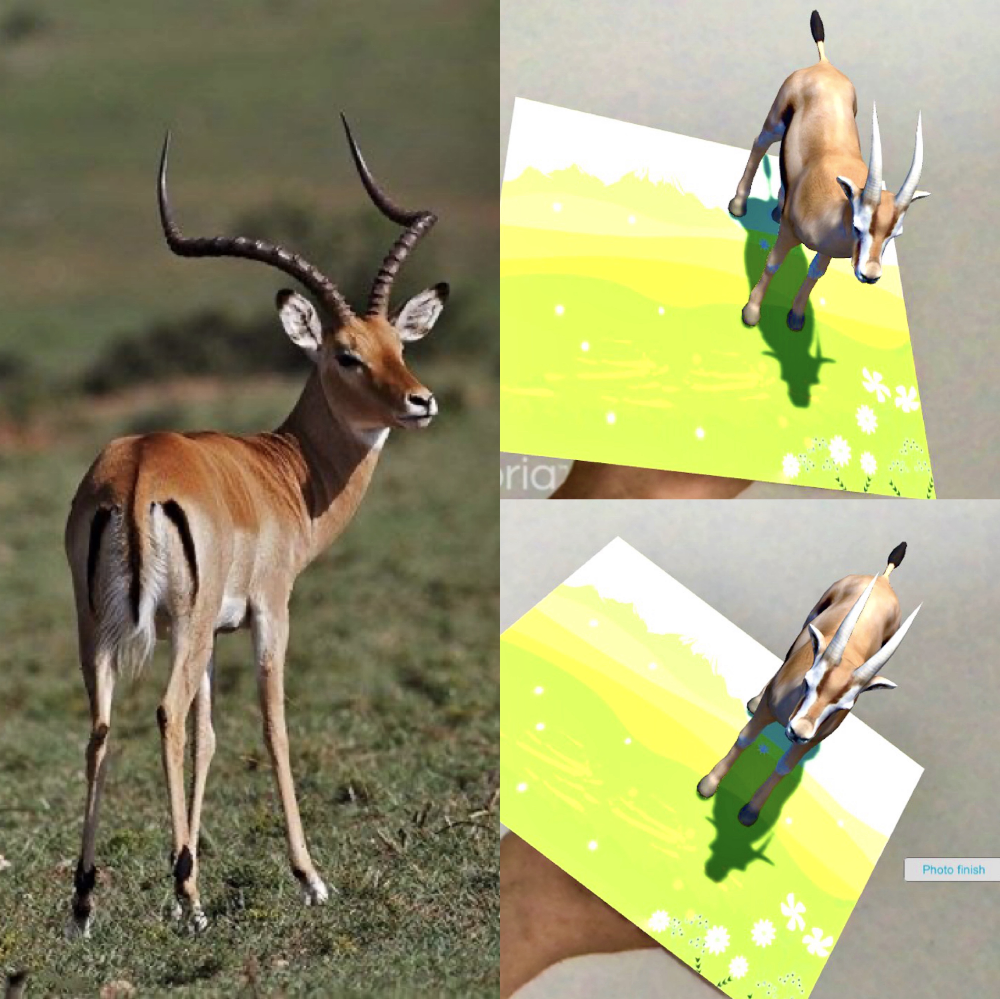
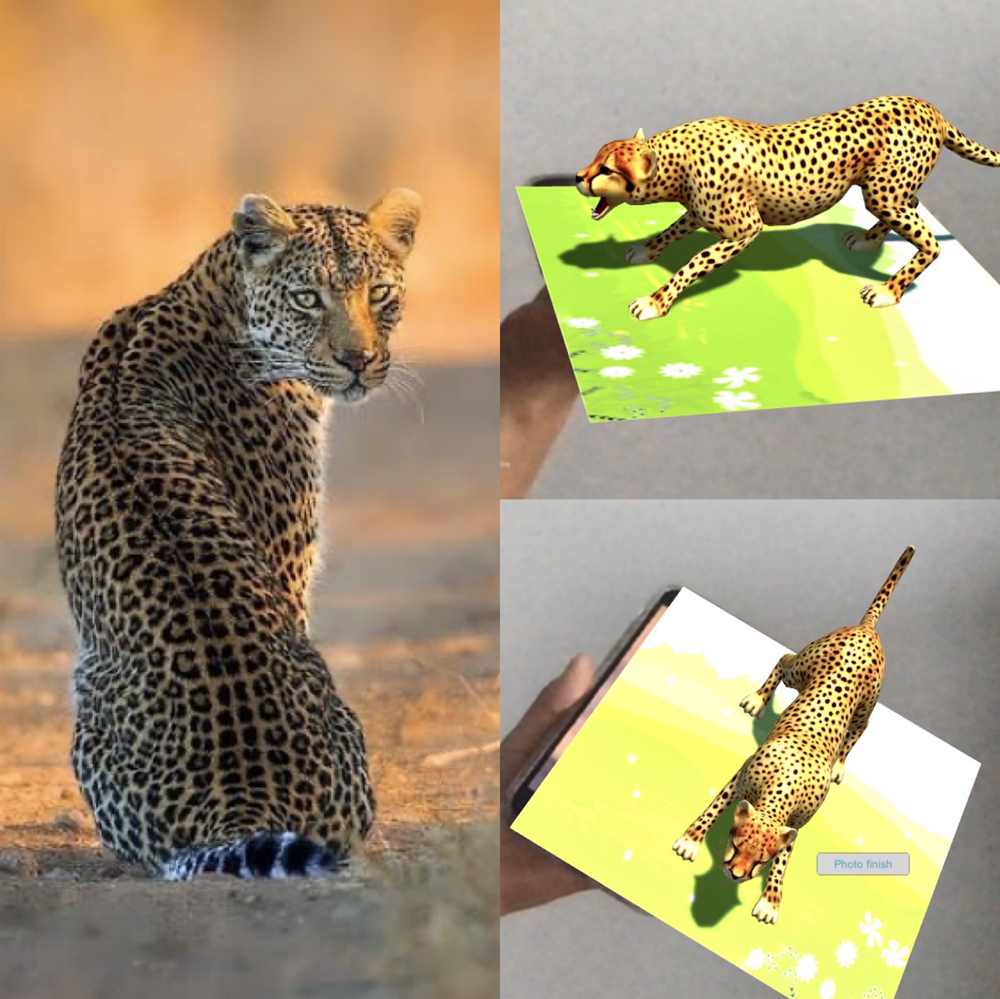
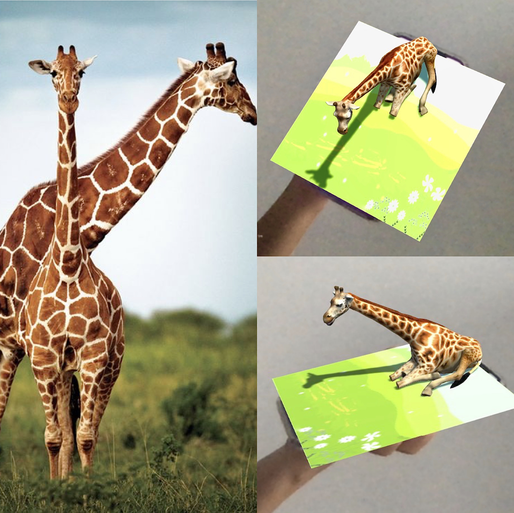

This is about the graphic knowledge of the animal that appears on the screen after the camera recognizes the picture of the animal

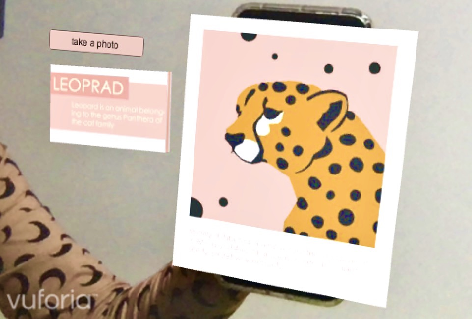
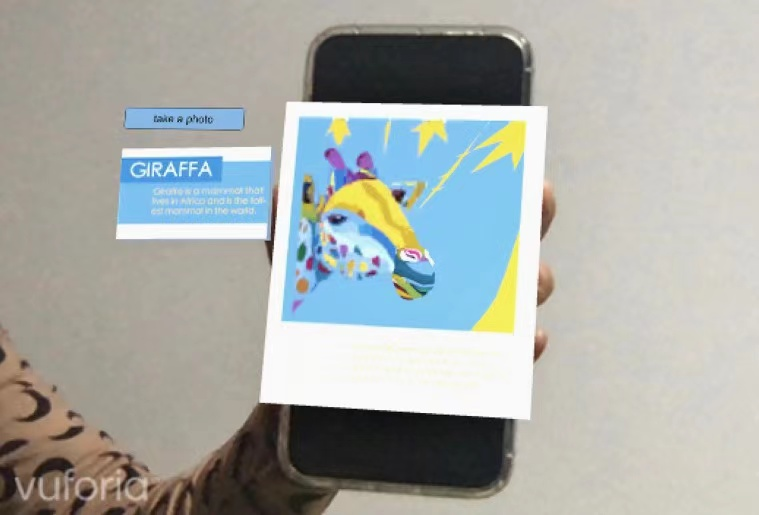
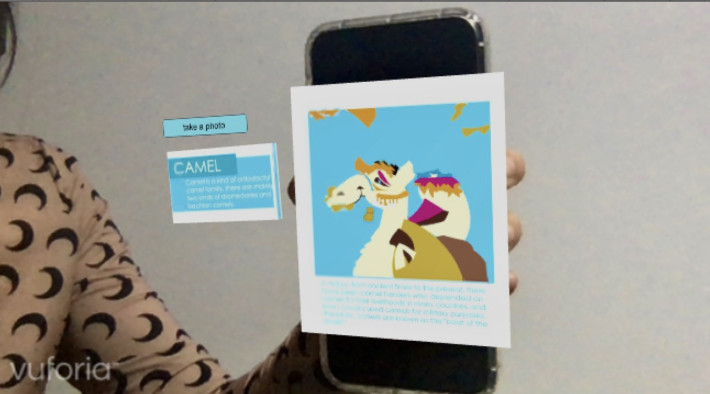
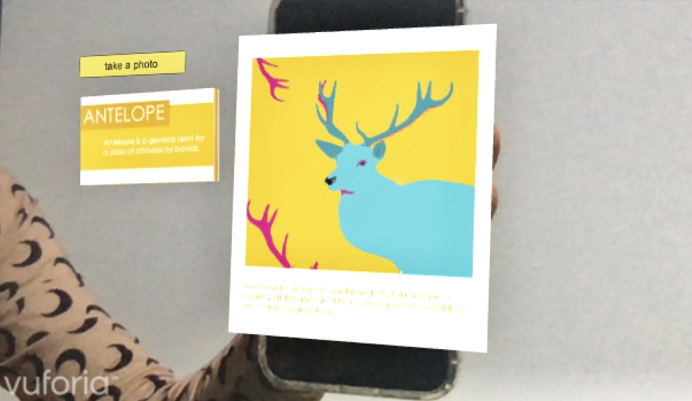
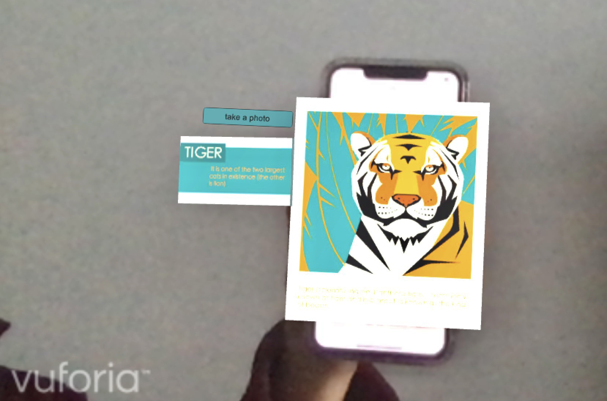
