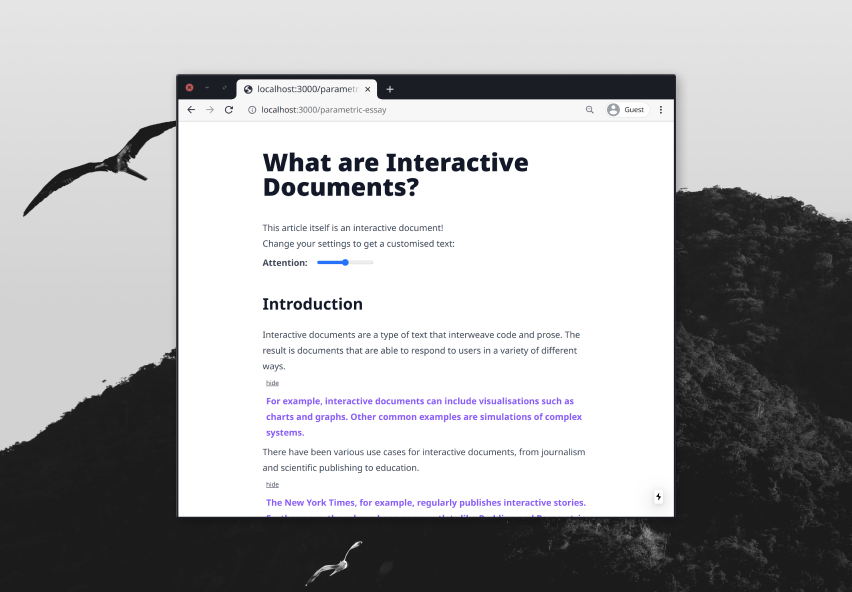
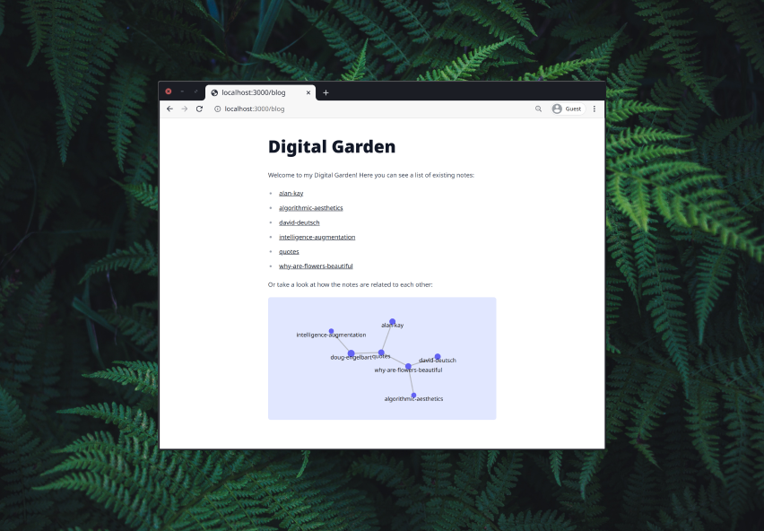

import { Mandelbrot } from "./mandelbrot"

Nowadays text is ubiquitous. Whether digital or analogue, text mediates almost any part of our experience in modern society. This trend has been especially amplified with the rise of computers, whose native language, the computer program, is itself a form of text.

This thesis explores the genre of interactive documents, a form of computer-based media that blurs the line between text as prose and text as executable code. Interactive documents are designed to provide rich and engaging documents that go beyond the possibilities of traditional textual media.

My research tries to answer the questions: What the types of experiences that a computational text medium can enable, and how can the act of authoring interactive documents be made as accessible as possible?

While interactive documents can often be very compelling ways to educate and to communicate complex information, there is still a significant overhead to producing them compared to static text.
The thesis explores ways in which one can simplify the authoring experience of interactive documents. I evaluate the usage of MDX, a Markdown extension that allows for writing JavaScript and JSX within Markdown, as a framework for authoring interactive documents.

To demonstrate the possible types of experiences that can be created with MDX, I produced three interactive documents, each representing an aspect.

You can read more about them below, and find each of them live under https://interactive-documents.vercel.app/.

#### Explaining the Mandelbrot Set, Interactively 

<Mandelbrot />

explorable example of a Mandelbrot Set

Interactive documents are a powerful way of explaining ideas. By interweaving text with explorable examples, it allows the reader to get an intuitive understanding of complex systems.

This essay gives an interactive explanation to the Mandelbrot Set, a notoriously famous object of Computer Graphics. It is famous for its intricate beauty and fractal patterns, but it is rarely understood from where these patterns emerge.
The essay allows the reader to gain an understanding actively and playfully.

https://interactive-documents.vercel.app/mandelbrot

#### Parametric text

How does a truly dynamic text that responds to the state of the reader look like? This document demonstrates the idea of a parametric document, a form of text that changes depending on the parameters that the reader inputs. It displays different levels of detail, depending on the reader's attention, and provides contextual information. 

https://interactive-documents.vercel.app/parametric-essay

#### Digital Garden

Interactive Document can not only influence the internal structure of documents, but can also make the ways in which documents relate to each other more explicit.

This example demonstrates how interactive documents can untangle reading into a non-linear experience. A digital garden is an online space that contains thoughts&mdash;from tiny notes to full articles&mdash;that are interrelated and continually evolving. Contrary to a traditional medium like books, text is not linear, but associative. It can be explored by the reader in any order they want.

The connections between the notes are visualised through an interactive network graph. The garden was seeded by a selection of my personal notes and texts that I collected during thesis research.

https://interactive-documents.vercel.app/blog 