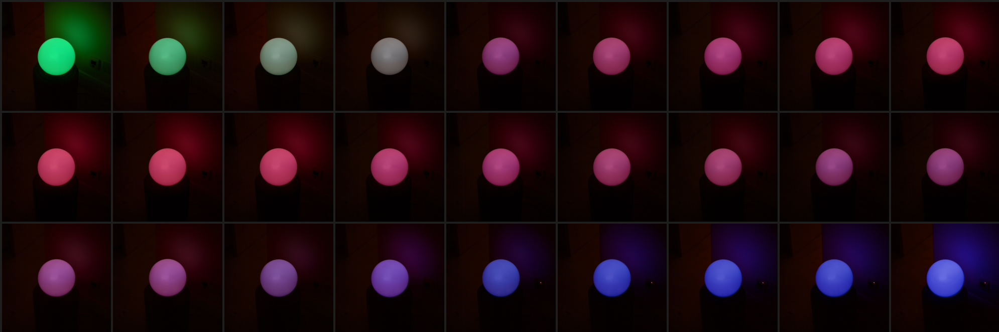
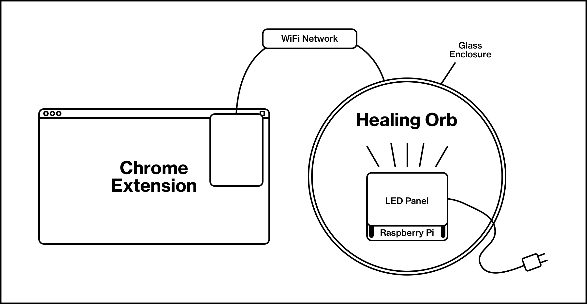
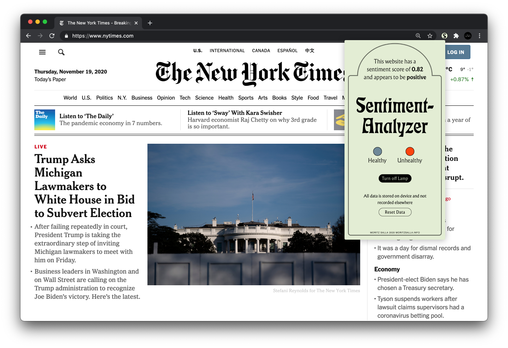
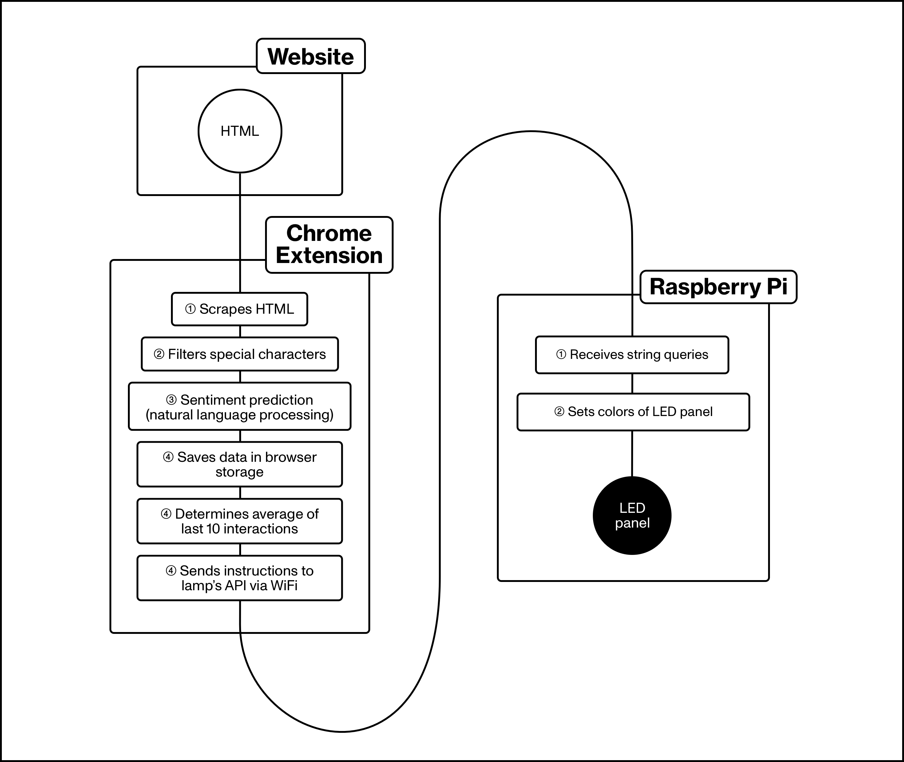

The Healing Orb is an exploration into how smart furniture can promote digital wellbeing. It recognises the need for mental wellbeing solutions in the tech industry and seeks to create awareness. Rather than relying on restrictive measures to enforce healthier content, the Healing Orb explores the notion of self-monitoring. This approach stands in contrast to most existing solutions. The Healing Orb is an ambient interface, in that it goes beyond the graphical user interface, and adapts the user's environment.

A significant problem to existing solutions is their restricted awareness of user behaviour. Screen time has access to the amount of time a user spends on which app. Internet filters detect which URL a user visits. In either case, whether or not an interaction is healthy depends solely on static factors, namely quantity of usage time, or blocklisted words. The Healing Orb explores the use of machine learning to overcome the limitations of traditional solutions. Machine learning can detect nuances and relationships of data. It can supply contextual and holistic insights into what kind of interaction a user is undertaking.

The Healing Orb is, in its simplest form, an RGB lamp in a glass enclosure. Its hue and brightness is dynamic and continuously responds to the user's input. A specific tone represents healthy, whereas another represents unhealthy content. The Orb will slowly fade its colour, dependent on the reading of the last ten websites viewed, and hence never requires active interaction. The easing rate is amount can easily be changed. Calculating the average of the previous ten interactions proved to be quick enough to be an accurate representation, whilst being slow enough to create noticeable change. The Healing Orb's appearance can therefore be read and understood by its viewer, yet discretely sits in situ like an item of furniture. Furthermore, the Healing Orb offers a browser popup, with UI that provides users with the possibility to set colour scheme. Users are also able to reset the data storage on their system.

The Healing Orb consists of two parts. The first component is software, running in the background of the user's computer. It collects and processes anonymous usage data. The second component is a wireless IoT device in the form of a round floor lamp. It displays data by setting the hue and brightness of its LED panel.

As a prerequisite to using the Healing Pod, the user must install a chrome extension. This extension scrapes website content, predicts its sentiment using machine learning and sends corresponding requests to the flask server's API. Processing the data is strictly kept to the client's side to simplify things, although it would be computationally favourable to perform these on the servers side. It requires a strong WiFi connection as an API request can get jammed, and latency creates less responsive interaction. The browser extension makes heavy use of chrome the storage to store user data.

The Healing Pod's ambient interface is a glass dome that contains a Raspberry Pi, running a dockerised flask server. This provides API to clients in the local network, allowing them the server to receive queries from multiple devices. The flask server then maps string queries to the Sense Hat's API. Part of the Sense Hat is a strong LED matrix, handy for prototyping interactions. Since the Raspberry Pi provides suitable hardware and software since it includes an operating system capable of wireless connectivity. There are, without doubt, cheaper, more bespoke IoT boards for this use case, yet they do not leave as much space for exploration. Running on the local wireless network, the Healing Orb is unlikely to suffer from loss of communication, can potentially be connected to by various devices, and can be placed freely within the apartment.

Whereas the lamp's function is fairly simply—it receives instructions and sets the lamp's hue and saturation—the extension does all of the data processing. After HTML content is scraped and filtered, a sentiment analysis model is used to predict negativity. Two pre–trained sentiment analysis models came into question: the TensorFlow Core model, trained on the large IMDB movie review dataset, and Google Cloud's API, which does not have a disclosed dataset. Whereas the TensorFlow model can be easily ported to tensorflow.js, Google Cloud provides its own, specialised API.
