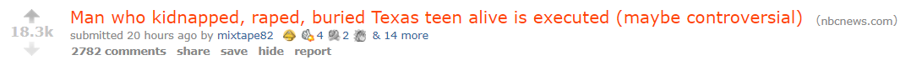

### Have you gotten your 2 minutes of hate, yet, today?

It was once inconceivable to have a scheduled period of time just to be angry at "the enemy." Now, thought? Entire 24/7 cable channels are devoted to enraging viewers. Whole networks of businesses and political parties exist simply to make people angry or afraid or anxious, and divide them in a useful way. Useful to the parties and businesses doing this division, but harmful to you, me, nature, and seemingly the fabric of reality itself.

_Controversy Warning_ is a first effort to remind us to avert our gaze from content meant to drag us into an "us vs them" situation. When something is highly controversial, there are people arguing.

<iframe width="560" height="315" src="https://www.youtube.com/embed/jYRutUkP-9Y" frameborder="0" allow="accelerometer; autoplay; clipboard-write; encrypted-media; gyroscope; picture-in-picture" allowfullscreen></iframe>

 

> Do we need that in our lives? Is it productive to wade in and try to form an opinion by absorbing others' opinions? Is that even our opinion or just a lazy copycat attempt at avoiding making an informed thought?

Avoid the others' fight. Use the time to relax and cultivate better virtues. Or, if you **really** want to read two thousand comments on **this** subject...

Using simple behavioral economics theories, by drawing users' attention to the potential negativities experienced by consuming the related content, I hope to get more people to simply move along. By consuming less negative content, and even better less tribal content, we can have a sunnier disposition and better feelings about our fellow human. As a second-order benefit, when "it bleeds, it leads" is no longer true to the media, then just perhaps we reduce the incentive for them to keep trying such nasty things.

The project uses a Chrome extension combined with a machine learning model trained to detect controversial titles to achieve this effect. It's not flashy, but it works alright.

#### Bonus? It considers every single embedded advertisement as controversial.
