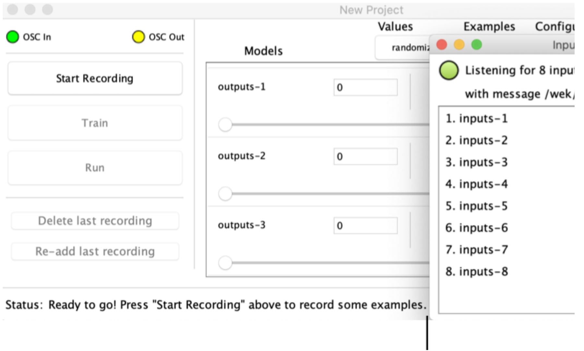
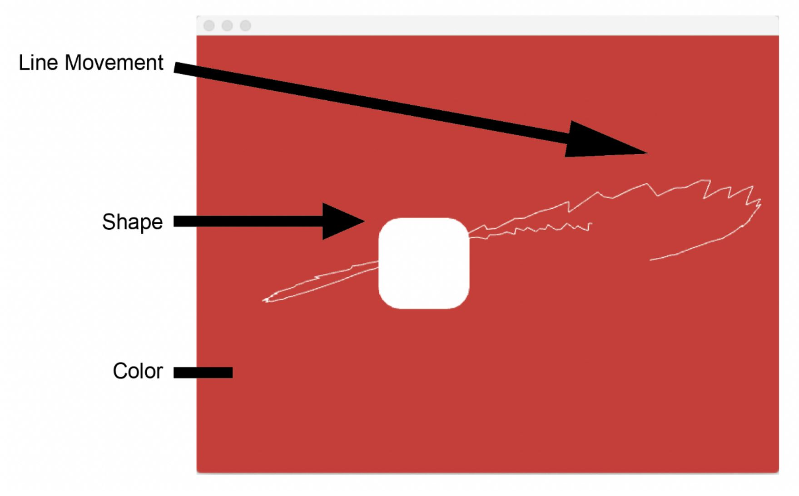

<iframe width="560" height="315" src="https://www.youtube.com/watch?v=ByVcCXy-KTw&t=15s" frameborder="0" allow="accelerometer; autoplay; clipboard-write; encrypted-media; gyroscope; picture-in-picture" allowfullscreen></iframe>

 

### Affective computing system

The initial ideal of this system is to use the facial capture technology, FaceOSC, combing with an
interactive machine learning application, Wekinator and a C++ based visualiser, to provide
customised emotion visualisation and playful user interface.

The communication of between these three sections are based on OSC signal.

### Face Capture

The input for this system is the facial expression of the user. Xiangsong used FaceOSC to capture
the data of the human face and make it usable for Wekinator by normalising and selecting with 8
different parameters. These 8 parameter are sent in OSC channel /wek/input.

### Wekinator

This is the core of the system, that used a machine learning model to process inputs and map
with outputs. The feature of the Interactive machine learning interface is providing a highly enduser friendly using experience. It also involve the users into the loop of design-refine mechanism,
which is also an interesting feature of the typical interface of interactive machine learning
applications.
Wekinator will process the inputs from FaceOSC and mapping the with 5 outputs to the visualiser
based on the control from the users.

### Visualizer

The visualiser developed based on OpenFrameWorks in C++.
The control of the visualiser had been defined with 5 different aspects:

1. Background colour (for controlling the colour, the control is based on changes in RGB
   value of the display colour, range in from 120-200)
2. Round corner ratio (for controlling the shape, the ratio is from 0-50)
3. Movement range (for controlling the line movement, the range is within +- 40 pixels in
   both x and y direction)
4. Movement path noise (for controlling the line movement, the range is within +-20 pixels)
5. Movement speed (for controlling the line movement, the range is from 1-1.50x speed)
   The graphic design is illustrated with the image below.

### Concept Proven experiment design

With the curiosity and passion in understanding the emotions in telework communication and
testing concept of his emotion visualisation system, an experiment was designed.
The procedure of this experiment can be summarised as:

1. Room, gear, and equipment set up.
2. Invite participants to train the visualisation system with IML.
3. Role-play in the simulated remote job interviews and fill in questionnaires.
4. Investigation with participants

