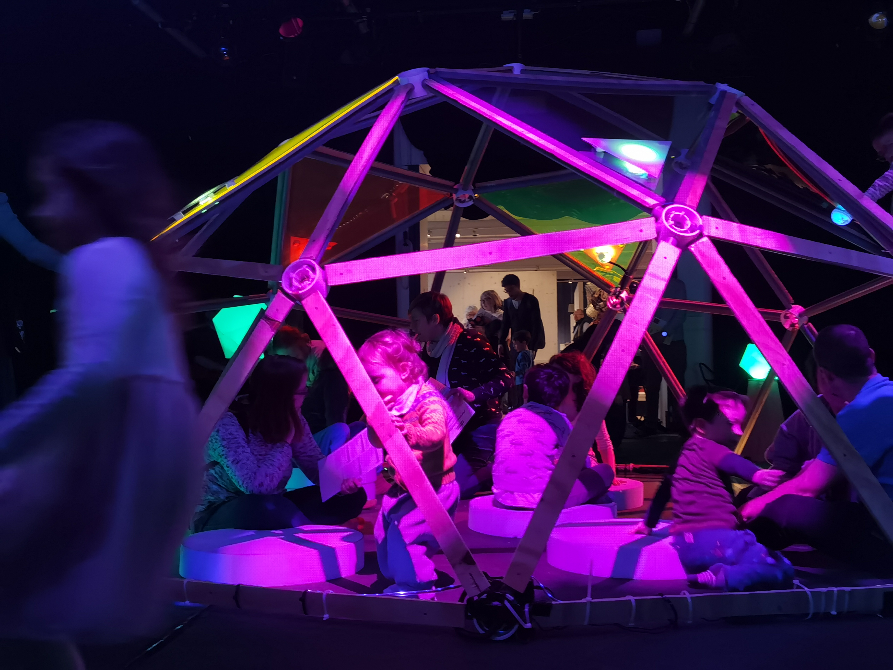
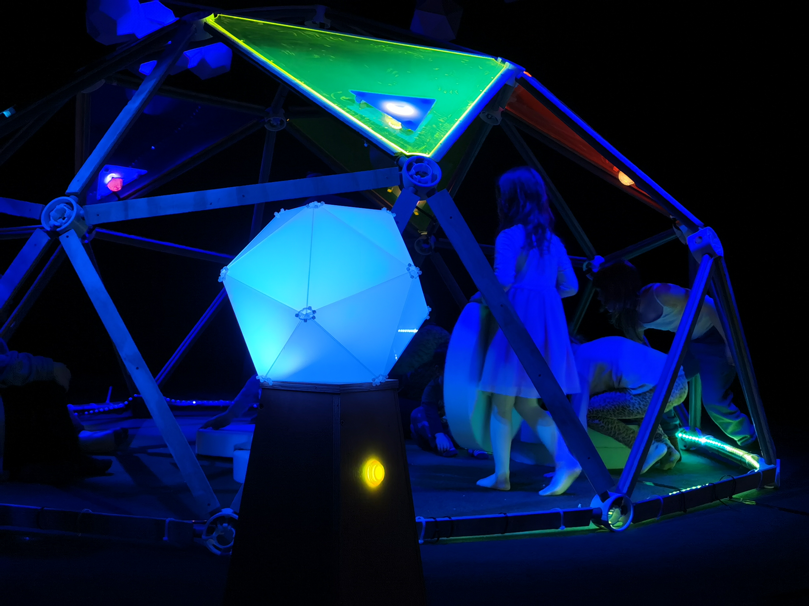
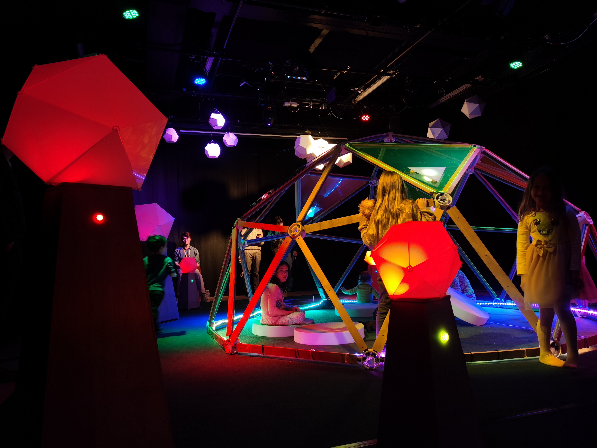

 Forest Daydream VR is an interactive VR experience that aimed to create emotional connections of players with the virtual world, while expressing the concern of global climate emergency nowadays. It is an open-ended game that players can interact with game objects and build on the virtual world.

 Download the game at: https://aaaraly.itch.io/forestdaydreamvr

<iframe src="https://vimeo.com/485396365=0&byline=0&portrait=0" style="position:absolute;top:0;left:0;width:100%;height:100%;" frameborder="0" allow="autoplay; fullscreen" allowfullscreen></iframe>

 

The concept of this VR game came from an interactive exhibition called Forest Daydream. Our whole class involved in implementing the exhibition. The exhibition created a rich and dynamic atmosphere by lightings and soundscape. The room was filled with interactive installations, and participants can press the buttons and to different weather states. The music composition by Ben Kelly, who also teaches at our creative computing institute, imitated the feeling as if participants are in the rainforest. The interactive nature of the exhibition attracted a lot of kids playing with it. Also, there were participants sitting and lying in the dome in the centre of the room, to just appreciate the immersive calmness brought by the exhibition.

The VR version of Forest Daydream shared the same environmental considerations as the exhibition, and I tried to interpret the features of the exhibition into a way that fit more into virtual reality.

###### Low-poly Aesthetics

###### Game Atmosphere

###### Weather state (day, night, wind, rain)

