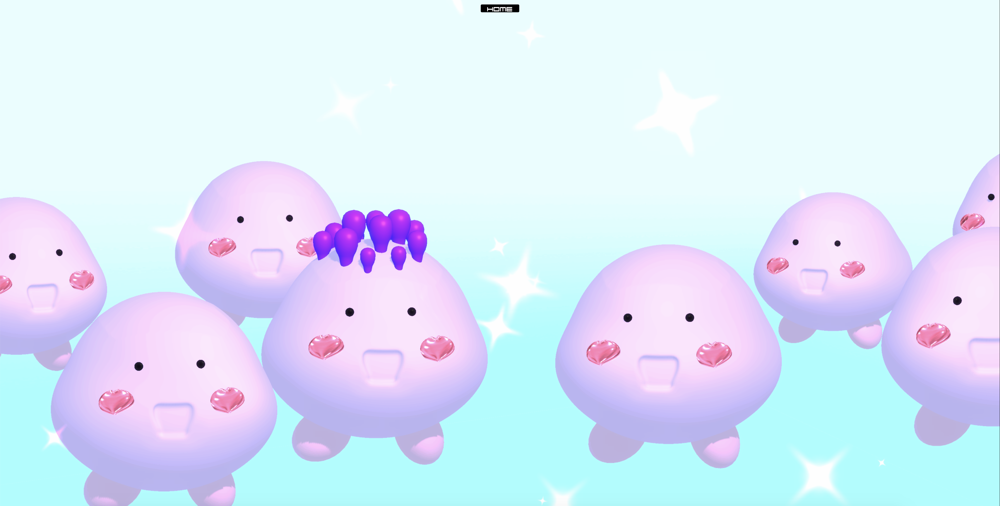
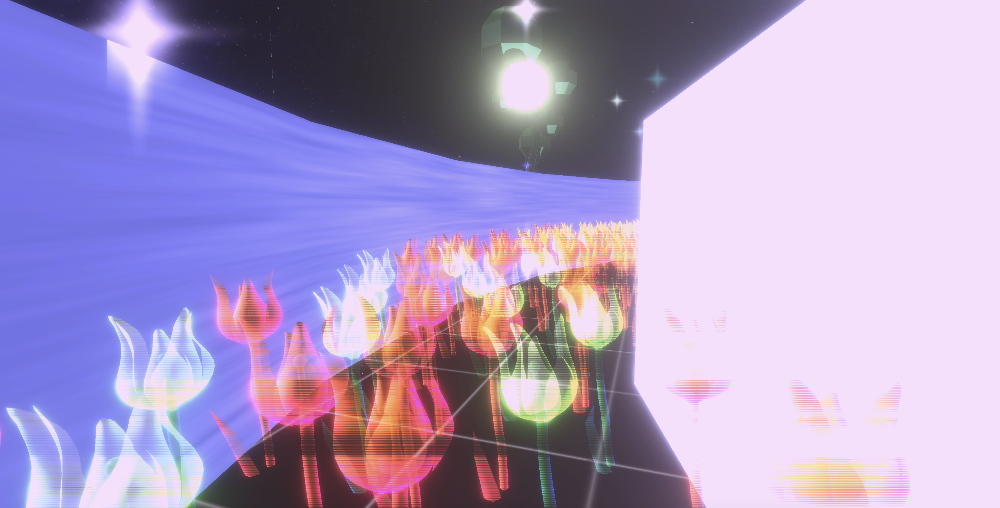

Many artists have their own ways to express their vision of the future, and I am curious of how the botanical garden will look like in a few decades. We need to rethink of our relationship with the nature, build stronger relationships between people and plants. My design gives people the opportunity to experience different botanical gardens and start thinking about how the botanical garden will look like in the future, and the changes that the botanical garden might face with so many problems that may occur in the future. I decided to create an immersive game that would allow everyone to experience different botanical gardens through digital devices. This work consists of six different scenes, which is named Future Botanical Garden. This is de- signed to reflect my own feelings about the future construction of the botanical garden. I want to give my audience an immersive environment where they can get the most au- thentic experience. In the main scene you will see four rooms, where each of them rep- resents a different world. Different characters have different stories. Entering each room will bring you into that specific world.

<iframe width="560" height="315" src="https://www.youtube.com/embed/7XaQH5GANH8" frameborder="0" allow="accelerometer; autoplay; clipboard-write; encrypted-media; gyroscope; picture-in-picture" allowfullscreen></iframe>

 

 

### Room 1: Watering Succulent

Watering Succulent is an e-plant that uses the data received by the sensor to grow. People will spray water on the small plant, then it will start to grow on the screen. De- pending on the humidity, the plant will grow. People feel pleasant when they grow their own plants and see the results. I hope that through this interactive game process and its lovely background music, people will be able to relax in the observatory and get some spiritual healing.

### Room 2: Balloon Cactus

In this world, cactus are like inflatable balloons, and their texture and appearance have changed a lot. The user needs to rescue balloon cactus trapped in the cube and interact with them. In the interaction between the physical part and the screen, the cactus is deformed and has an elastic appearance like a balloon. It is completely different from the cactus that should be touched in utmost careful in real life. This world allows people to discover interesting interactive experiences in the exploration and get close contact with futuristic creatures.

### Room 3: Digital Garden

This room is a computer art garden, where the flowers are made with code-generated shades and pictures. The world is a maze and the exit will lead people back to the main scene. It is completely different from a real garden. You will see flowers up close in 3D space and instinctively touch the beautiful flowers. The original intention of designing Room 3 is that I want to unleash the limitations of simulated reality and create a virtual world garden, which of course is completely virtualized. I do not want to bring real things in the real world to the screen.

### Room 4: Organ Tree

There is a towering tree in this room, which cultivates human organs. You can see the square fluid hanging from the tree keeps the organs growing, and the big trees feed and help them grow. They are like the fruits of plants, from bearing fruit to maturity. In the room, human organs and plant organs are closely linked, and can grow together. Eventually, humans will use the matured organs to help those in need of organ transplants. Under the transformation of biotechnology and genetic engineering, big trees have be- come completely different, and they can meet the human needs while growing in a better way.

#### Download the game here: <https://blueginger.itch.io/future-botanical-garden>
